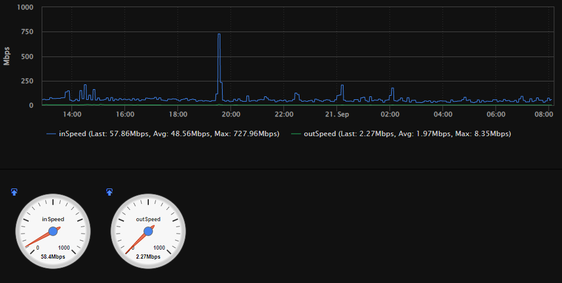

# check_snmp_iftraffic
Nagios and Icinga Plugin for Checking Interface Traffic Statics

Forked and modified from check_iftraffic64.  Some things could have broke from version I forked from after I converted and modified to meet my specific wants and needs.

### Prerequisites

Net-SNMP == 5.7 for basic functionality.

Net-SNMP >= 5.8 for AES-192 and AES-256 support.

Net-SNMP: http://www.net-snmp.org/

Want AES-192 and AES-256 support?  Compile net-snmp as such:

```
./configure --enable-blumenthal-aes [--bindir=/usr/bin]
make
make install
```

Usage of bindir is optional.  **_Use at your own risk!_**  I've had no issues with installing 5.9.1 into the main location (/usr/bin).  Nagios XI still works fine (for me).  No specification for --bindir usually puts installation files in /usr/local/bin which may affect the script.


Performance Graph with all perfdata disabled except In and Out Speed:


